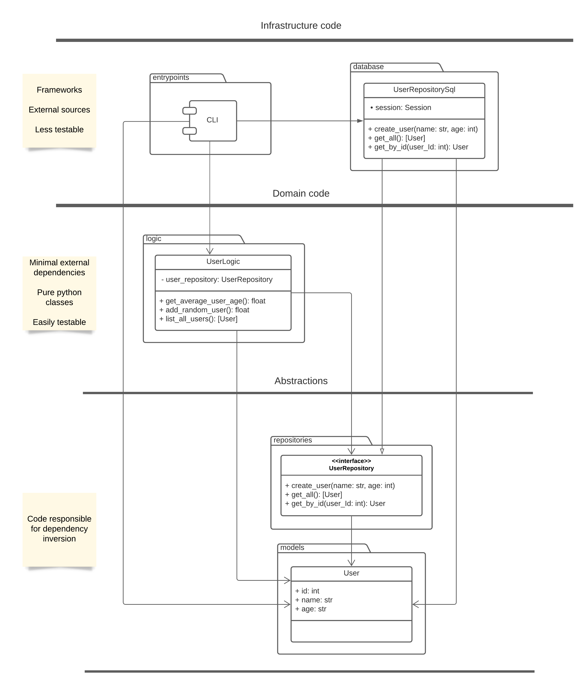

[](https://codecov.io/gh/sukovanej/python-persistence-abstraction-example)

# Python architecture example with abstracted persistance layer

This repository contains a working Python codebase showing how to invert dependencies between
database module and the logic.

Note: what I call a `repository` is not really the repository pattern that usually occurs in
the literature. Instead, I use the name repository for a class that hides the database access
behind concrete interface which is not generally the same for different repository classes.

## What I want to achieve

 - the most important logic testable independently of the database
 - no cycles in the class diagram, single direction of dependencies
 - strict type check-ing for the whole codebase
 - tests working out of the box (no setup needed for triggering tests) with 100% test coverage

## Class design



## Technical details

### Mapping SQLAlchemy tables onto existing classes

Models are created indepdently of the SQLAlchemy and in the database module they are
mapped onto table definitions.

```python
from dataclasses import dataclass

from sqlalchemy import Column, Integer, MetaData, Table, Text
from sqlalchemy.orm import registry


metadata = MetaData()


users = Table(
    "users",
    metadata,
    Column("id", Integer, primary_key=True, autoincrement=True),
    Column("name", Text),
    Column("age", Integer, nullable=False),
)

mapper_registry = registry()


@dataclass
class User:
    id: int
    name: str
    age: int


mapper_registry.map_imperatively(User, users)
```

### Database repositories testing

 - SQLite (SAVEPOINT[https://www.sqlite.org/lang_savepoint.html]

## Static analysis and tests

 - **black** - 120 line-length
 - **isort** with black profile
 - **mypy** using the *strict* mode
 - **pytest** with *pytest-cov* for test-coverage
